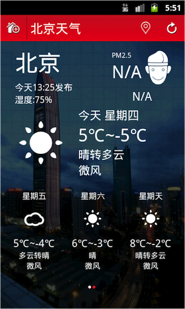

#目录

[toc]

## 天气预报教学案例

###案例简介

天气预报是大家日常生活中最熟悉的应用之一，任何同学手机中都会有一款天气预报APP。因此，在课堂上以天气预报作为教学案例，学生很容易接受。并且在实现过程中，同学可以根据自己的想法，实现一个属于自己的天气预报小应用。

开发环境

- Android开发工具： Android Studio 2.1或2.2

- SDK版本：Android 6.0， API 23

  

###知识点对照关系

###实践步骤详解

- 首页工具栏布局
- 首页今日天气信息界面布局
- 创建多线程任务
- 获取网络数据
- 解析JSON格式数据
- 更新首页今日天气数据
- 城市管理界面设计
- Application对象使用
- SQLite数据库操作
- 通过ListView展示城市列表
- 处理ListView单击事件
- 搜索城市功能设计
- 首页更新功能设计
- 定位功能设计
- 未来n天界面设计
- 后台自动更新天气
- APP Widget设计
- 引导界面设计
- APK文件签名
- 总结

